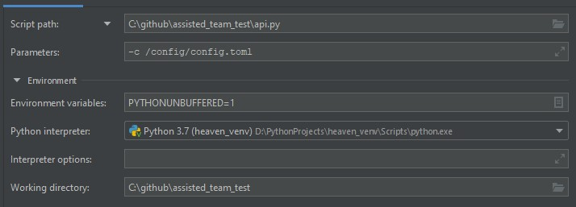

# assisted_team_test
Простенький веб сервис, показывающий полезную инфу по перелётам, а также
разницу между двумя файлами. Основная логика построена на парсинге xml файлов. 

## Задача

Есть два XML – это ответы на поисковые запросы, сделанные к одному из 
партнёров. В ответах лежат варианты перелётов (тег `Flights`) со всей 
необходимой информацией.

Нужно сделать вебсервис, в котором есть эндпоинты, отвечающие на следующие 
запросы:

* Какие варианты перелёта из DXB в BKK мы получили?
* Самый дорогой/дешёвый, быстрый/долгий и оптимальный варианты
* В чём отличия между результатами двух запросов (изменение маршрутов/условий)?

Язык реализации: `python3`.
Формат ответа: `json`.
Используемые библиотеки и инструменты — любые на выбор.

### Описание

API со следующим набором эндпоинтов:

    • /v1/parse?parameters - Получение вариантов (дорогой/дешёвый, 
                             быстрый/долгий и оптимальный) перелёта 
                             из DXB в BKK
                             
    • /v1/diff             - Симметричная разница между двумя файлами

Сервис работает на ``python 3.7``.

Фреймворк для написания API — ``aiohttp``. 

Библиотека для создания простенького REST API ``aiohttp_rest_api``
Документация: [https://aiohttp-rest-api.readthedocs.io/](https://aiohttp-rest-api.readthedocs.io/)

Конфиг приложения находится: [/config/config.toml](config/config.toml)

## Getting started
Для запуска необходимо выполнить команду: `docker-compose up -d`

После запуска раскатится docker контейнер:

    • Контейнер веб приложения на http://127.0.0.1 по умолчанию

Файл [PostmanCollection](assisted_team_test.postman_collection.json) содержит
примеры запросов на все API, который можно импортнуть в Postman

## Подробнее об методах API

    • GET http://localhost/v1/parse?need_return=<name>&action=<name>

    need_return:
        true - парсит файл RS_Via-3.xml с обратным направлением (параметр по умолчанию)
        false - парсит файл RS_ViaOW.xml без обратного направления
    
    action:
        cheap - варианты полётов, начиная с самого дешёвого билета (параметр по умолчанию)
        fast - варианты билетов, начиная с самого быстрого перелёта
        expensive - варианты полётов, начиная с самого дорогого билета
        slow - варианты билетов, начиная с самого медленого перелёта
        optimal - оптимальные варианты билетов 
    

    • GET http://localhost/v1/diff

- Идея парсинга ``/v1/parse`` заключается в первоначальной имитации выбора пользователя. 
Из условия задачи мне известно: пункты назначения, дата, два файла на выбор 
с необходимой информацией. Вилкой логики служит имитация выбора пользователем 
обратного направления (параметр ``need_return``). Не вижу смысла на 
один запрос пользователя скачивать сразу два файла вариантов билета, при условии, 
что партнёр гарантирует предоставить всю необходимую информацию. Это 
просадка по производительности, а также не стоит забывать о том, что у меня
не один партнёр по предоставлению информации о перелётах (но это уже за рамками 
текущей задачи). Мне достаточно попросить пользователя указать необходимость 
обратного билета, либо же сделать по умолчанию не брать в расчёт обратное 
направление.

- Собранные варианты перелётов учитывались из соображения - что для удобства 
пользователя лучше? Конкретно для меня важны параметры времени и цены. ``cheap``
покажет варианты билетов, начиная от самого дешёвого, но и в то же время быстрого по 
времени, если цены одинаковые. ``fast`` покажет варианты билетов, начиная от самого 
быстрого, но и в тоже время наиболее дешевого при одинаковом времени. 
``expensive`` покажет варианты билетов, начиная от самого 
дорогого, но и в тоже время наиболее быстрого по времени, если цена одинакова.
``slow`` покажет варианты билетов, начиная от самого 
медленного перелёта, но и в тоже время наиболее дешёвого, если время перелёта 
совпадает. Интересный выбор ещё ``optimal``, который совпадает с вариантом 
``fast``. Почему так и почему бы не зашиться на прямые перелёты и не выделить
этот вариант в отдельную сортировку выборки данных? 
Если подумать логически, то я не встречал быстрых непрямых перелётов. 
Учитывая поведение пользователя, то он глянет максимум 5 вариантов, а может и 
меньше.   

- Идея показа разницы между файлами ``/v1/diff`` основана на симметричной разницы
тегов и аттрибутов файлов. Теги укажут на то, какого узла иерархии не хватает. 
Например, узла с информацией об обратных билетах ``ReturnPricedItinerary``. 
Атрибуты укажут разницу между перевозчиком ``Carrier``. Перевозчик, на самом деле,
очень важный параметр, особенно, если он является участником крупного 
международного альянса как свидетельства об авиационном здоровье. Также разница 
может быть и в отсутствии каких-либо тарифов в ``ServiceCharges``, например, информация о стоимости
билета для ребёнка ``SingleChild``.

### Локальный запуск приложения

Настрока через PyCharm:

### Мысли об улучшении и проблемы, с которыми столкнулся

 - Проблема дубликата тегов ``Flights``. Пришлось накручивать кастомную логику 
 по фильтрации
 
 - Проблема уникальности данных. Не к чему цепляться, id например и нет гарантии, 
 что данные не повторяться. (по краней мере опасения имеются)
 
 - Проблема одного партнёра. Мне неизвестно как выглядят другие файлы от других 
 партнёров. Предполагаю, что общего регламента по тегам, возможно, там и нет. 
 Иерархии отличаются. Соответственно назревает вопрос об универсальности и 
 маштабируемости. 

 Мысли об улучшении:
 
 - Необходимость в улучшении или изменении логики сортировки. Сейчас она выглядит
 по нубски. Но в рамках MVP - сортировка работает.
 
 
 - Хардкод на два файла, можно изменить код и сделать более универсальным.
 
 - Можно добавить дополнительные параметры, например, длительность пересадки. \
 Фильтрацию по тарифу.
 
 - Возможно стоит прикрутить ``pytest``.
